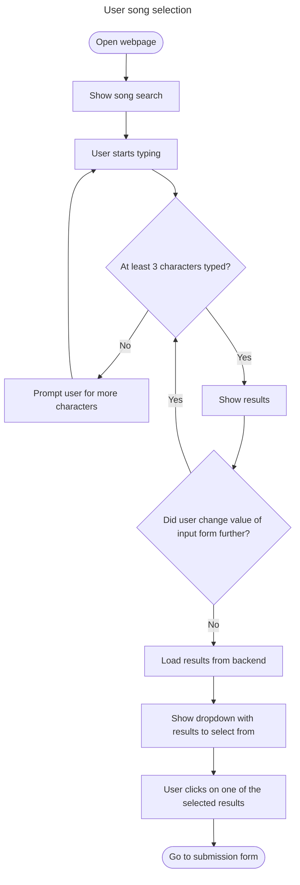

# User workflow

```mermaid
---
title: User song selection
---
flowchart TD
  Start([Open webpage]) --> Search[Show song search]
  Search --> Searching[User starts typing]
  Searching --> ShowingResults{At least 3 characters typed?}

  ShowingResults -->|No| ShowMessage[Prompt user for more characters]
  ShowMessage --> Searching
  ShowingResults -->|Yes| ShowResults[Show results]

  ShowResults --> SearchingMore{Did user change value of input form further?}
  SearchingMore --> |Yes| ShowingResults
  SearchingMore --> |No| LoadResults[Load results from backend]

  LoadResults --> Dropdown[Show dropdown with results to select from]
  Dropdown --> Selection[User clicks on one of the selected results]
  Selection --> SubmissionForm([Go to submission form])
```
