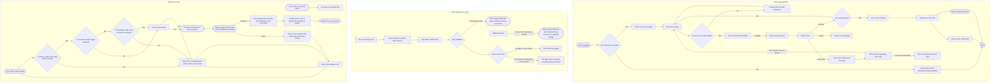

# User workflow

```mermaid

flowchart TD
  subgraph User song selection
    Start([Open webpage]) --> AreSubmissionEnabled{Are submission enabled?}
    AreSubmissionEnabled --> |Yes| Search[Show song search page]
    AreSubmissionEnabled --> |No| ShowDisabledSubmissionPopup[Show popup about submissions being disabled]
    ShowDisabledSubmissionPopup ---> EndSelect([End])
    Search --> Searching[User starts typing]
    Searching --> ShowingResults{At least 3 characters typed?}

    ShowingResults --->|No| ShowMessage[Prompt user for more characters]
    ShowMessage --> Searching
    ShowingResults -->|Yes| FetchResultsFromBackend[Fetch results from backend]
    FetchResultsFromBackend --> |Loading| LoadingSpinner[Show loading spinner]
    LoadingSpinner --> ResultsFromBackend[Show results]

    ResultsFromBackend -->|No Results| NoResults[Show 'No results found' message]
    NoResults --> ShowRequestSongButton[Show button requesting new song]
    ShowRequestSongButton --> |User clicks the button| SubmittingSong[New song submission form start]
    ShowRequestSongButton --> |User doesn't click the button| Searching
    ResultsFromBackend -->|Failure| ErrorMsg[Show error message]
    ResultsFromBackend --> |Success| SearchingMore{User changes input?}
       
    SearchingMore -->|Yes| Searching
    SearchingMore -->|No| SelectResult[User selects a result]

    SelectResult --> SubmissionForm[Submission form start]
    SubmissionForm --> Cancel[User cancels submission] --> EndSelect
    SubmissionForm --> Submit([Show submission form])
    Submit --> EndSelect
  end
  subgraph User submits new song
    StartSubmittingSong[Start submitting song] --> ShowElements[Show input for song title, artist and urls]
    ShowElements --> SubmitNewSong[User clicks submit song]
    SubmitNewSong --> ValidateSongInput{Input validation}
    ValidateSongInput --> |All inputs are valid| ValidationSuccessfull([Show popup informing about submission being successful])
    ValidateSongInput --> WhatToDo{Choose what to do}
    ValidaSongInput --> |One or more inputs are invalid| ValidationError([Show popup informing about values being incorrect an requiring change])
    WhatToDo --> |Go back to song search| StartSearching[Start searching again]
    WhatToDo --> |Go directly to submission form request| SubmissionFormRequest[Go right away to request song that was just created]
  end
  subgraph "Submission form"
    BackToSearchButton([User clicks on back to search]) --> SelectSongRedirect[Go back to song selection]

    SubmitButton([User clicks 'submit' button]) --> PrimarySingerValid{Is primary singer input valid and not empty?}
    PrimarySingerValid --> |Yes| SecondaryEnabled{Is secondary singer toggle enabled?}
    PrimarySingerValid ---> |No| ShowError[Show error message about which values are incorrect] --> ConfirmError[User acknowledges error]
    SecondaryEnabled --> |Yes| SecondarySingerValid{Is secondary singer input valid and not empty?}
    SecondaryEnabled --> |No| NotesValid[Is notes input valid?]
    SecondarySingerValid --> |Yes| NotesValid
    NotesValid --> |No| ShowError
    NotesValid --> |Yes| GatherData([Process submission of queue request])
    SecondarySingerValid ---> |No| ShowError
    GatherData --> ProcessSubmit([Gather singers names and notes specified by submitter])
    ProcessSubmit --> |Success| PopupSuccess[Show popup with message that submission was successful]
    ProcessSubmit ---> |Error| ShowErrorProcessing[Show error message with information what went wrong]
    ShowErrorProcessing --> ConfirmError
    ShowError --> ConfirmError
    ConfirmError --> SubmitButton
    PopupSuccess --> OperatorSubmission[Submit queue entry to backend for operator to handle]
    OperatorSubmission --> ReturnToSearch([Return to song selection])
  end
```
