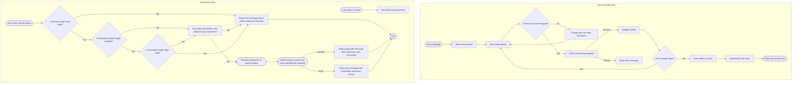

# User workflow

```mermaid

flowchart TD
  subgraph User song selection
    Start([Open webpage]) --> Search[Show song search]
    Search --> Searching[User starts typing]
    Searching --> ShowingResults{At least 3 characters typed?}

    ShowingResults -->|No| ShowMessage[Prompt user for more characters]
    ShowMessage --> Searching
    ShowingResults -->|Yes| FetchResultsFromBackend[Fetch results from backend]

    FetchResultsFromBackend -->|Success| ShowResults[Display results]
    FetchResultsFromBackend -->|Failure| ErrorMsg[Show error message]

    ShowResults --> SearchingMore{User changes input?}
    SearchingMore -->|Yes| Searching
    SearchingMore -->|No| SelectResult[User selects a result]

    SelectResult --> SubmissionForm[Submission form start]
    SubmissionForm --> Submit([Show submission form])
  end
  subgraph "Submission form"
    EditSongButton([User clicks on close]) --> SelectSongRedirect[Go back to song selection]

    SubmitButton([User clicks 'submit' button]) --> PrimarySingerValid{Is primary singer input valid?}
    PrimarySingerValid --> |Yes| SecondaryEnabled{Is secondary singer toggle enabled?}
    PrimarySingerValid ---> |No| ShowError[Show error message about which values are incorrect] --> End([End])
    SecondaryEnabled --> |Yes| SecondarySingerValid{Is secondary singer input valid?}
    SecondaryEnabled --> |No| ValidNotes[Are notes specified by user valid string of characters?]
    SecondarySingerValid --> |Yes| ValidNotes
    ValidNotes --> |No| ShowError
    ValidNotes --> |Yes| GatherData([Process submission of queue request])
    SecondarySingerValid ---> |No| ShowError
    GatherData --> ProcessSubmit([Gather singers names and notes specified by submitter])
    ProcessSubmit --> |Success| PopupSuccess[Show popup with message that submission was successful]
    PopupSuccess --> End
    ProcessSubmit ---> |Error| ShowErrorProcessing[Show error message with information what went wrong]
    ShowErrorProcessing --> End
  end
```
